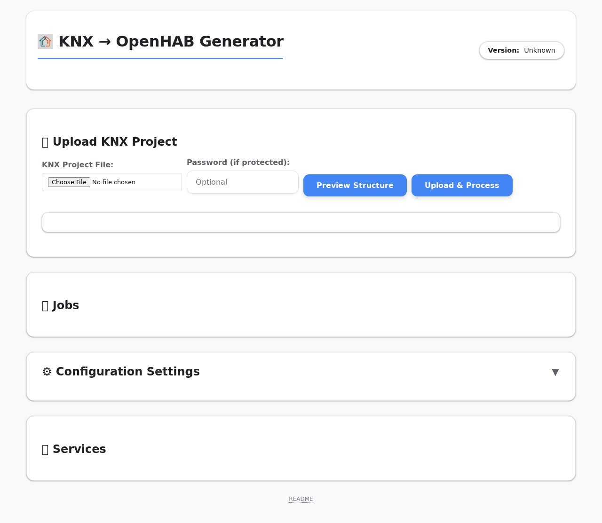
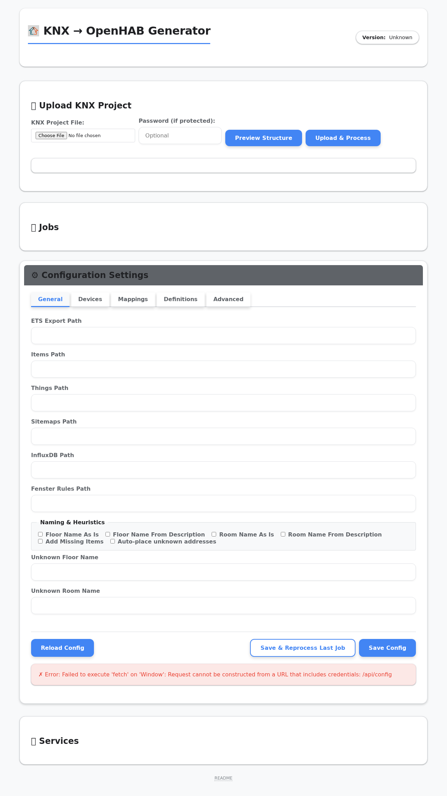

# KNX to OpenHAB Generator

A powerful tool to generate complete [OpenHAB](https://www.openhab.org/) configurations (Items, Things, Sitemaps) directly from your ETS project export (`.knxproj`) or JSON dump.

It includes a **Web UI** for easy management, file uploads, and monitoring, as well as a **CLI** for automated workflows.

## Features

- **Automated Generation**: Creates Things, Items, and Sitemaps automatically.
- **Smart Detection**: Identifies Dimmers, Rollershutters, and Thermostats based on DPT and naming.
- **ETS Integration**: Reads `.knxproj` files directly.
- **Web Interface**: Browser-based UI to upload projects and monitor generation (great for Raspberry Pi).
- **Semantic Model**: Automatically tags items for OpenHAB's model.
- **InfluxDB Support**: Auto-configure persistence via ETS description tags.

## Documentation

- **[User Guide](docs/USER_GUIDE.md)**: Configuration, ETS preparation, Logic, and Troubleshooting.
- **[Production Guide](docs/PRODUCTION_GUIDE.md)**: Installation on Raspberry Pi/DietPi (Service, Systemd).
- **[Developer Guide](docs/DEVELOPER_GUIDE.md)**: Architecture, Testing, and Local Development.

---

## Quick Start (Installation)

### One-Command Installer (Linux / Raspberry Pi)
Ideally use a fresh install of Raspberry Pi OS (Lite) or DietPi.

**Prereqs (apt):** `python3-venv python3-tk build-essential`

```bash
curl -sSL https://raw.githubusercontent.com/diddip21/knx_to_openhab/main/install.sh | bash
```

This will:
1.  Install system dependencies (Python, git, etc.)
2.  Clone the repository to `/opt/knx_to_openhab`
3.  Set up the **knxohui** service (Web UI)
4.  Configure permissions for self-updates

### Uninstallation

```bash
curl -sSL https://raw.githubusercontent.com/diddip21/knx_to_openhab/main/uninstall.sh | bash
```

### How to Use

1.  **Open the Web UI**: Browser to `http://<your-ip>:8085`.
    - **User**: `admin`
    - **Password**: `logihome` (Change this in Settings!)
2.  **Upload Project**: Upload your `.knxproj` export or JSON dump.
3.  **Configure**: Go to **Settings** to map DPTs or adjust naming rules.
4.  **Generate**: The system automatically generates Items, Things, and Sitemaps.
5.  **Update**: Click the Version badge in the header to check for and apply updates.

---

## UI Reports & Auto-Placement

The UI surfaces **reports** for anything that couldn't be fully placed (unknown or partial items). You can optionally enable **auto-placement** to create missing floors/rooms for unmatched addresses.

- **UI toggle:** Settings → **Auto-place unknown addresses**
- **Config flag:** `config.json` → `general.auto_place_unknown`
- **Report export:** In the *Generated Files* table you can **Preview / Download / Copy** `unknown_report.json`, `partial_report.json`, and `completeness_report.json` (unknown report is generated even when `addMissingItems` is disabled)

**Home overview**



**Settings (auto-place toggle)**



---

## License

This project is open-source.