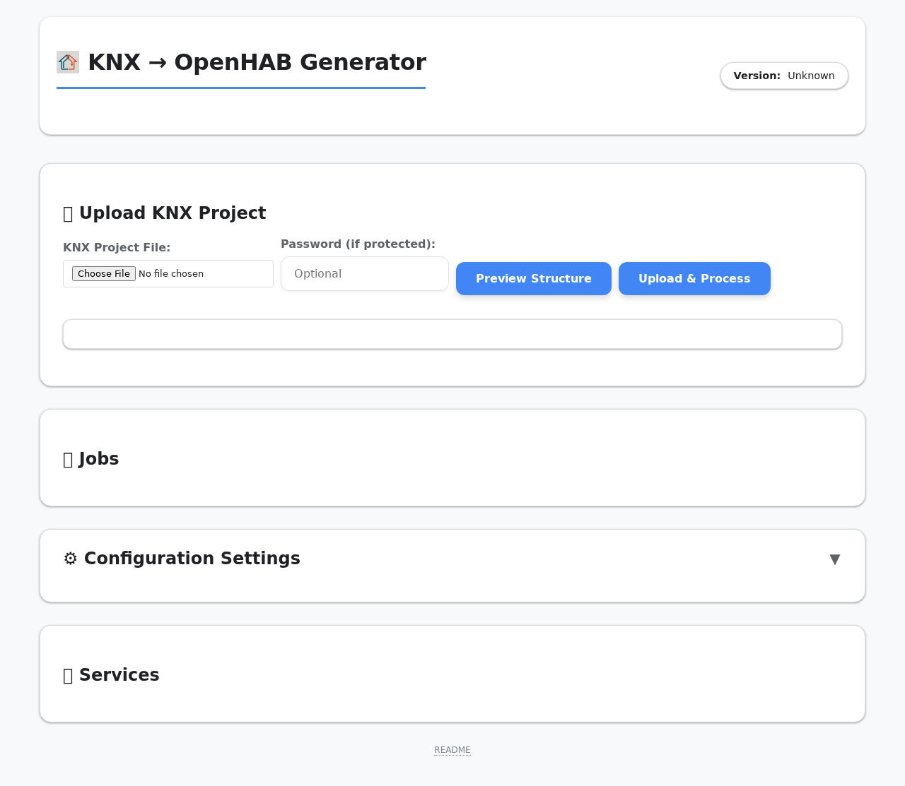
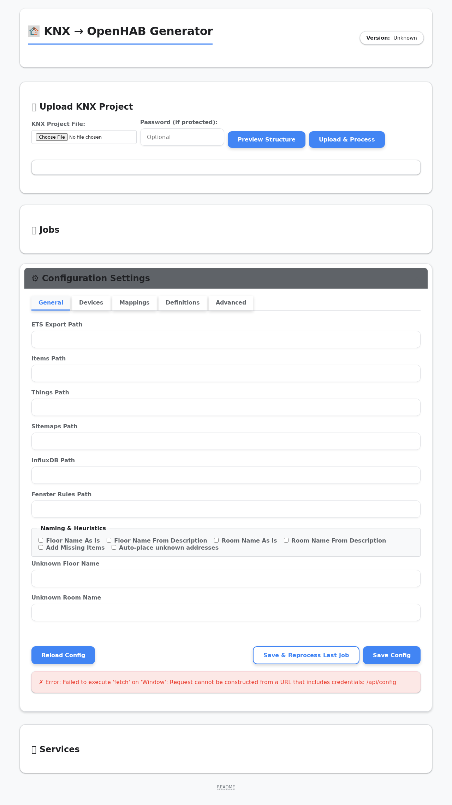

# KNX to OpenHAB Generator

A tool that generates complete [OpenHAB](https://www.openhab.org/) configurations (Items, Things, Sitemaps, Persistence) directly from ETS project exports (`.knxproj`) or JSON dumps.

Includes a **Web UI** for browser-based management and a **CLI** for automated workflows.

## Features

- **Automated Generation** — Creates Things, Items, Sitemaps, and Persistence rules in one step
- **Smart Detection** — Identifies Dimmers, Rollershutters, Thermostats, and multi-address components by DPT analysis and naming conventions
- **Web Interface** — Drag-and-drop upload, live progress streaming (SSE), job history, diff viewer, deploy/rollback
- **Backup & Rollback** — Automatic tar.gz backup before each generation, restore any previous version
- **Reports** — Unknown addresses, partial items, completeness checks (missing required channels)
- **Auto-Placement** — Optional: automatically create missing floors/rooms for unmatched addresses
- **Semantic Model** — Auto-tags items for OpenHAB's semantic model
- **HomeKit / Alexa** — Auto-generates metadata when enabled in ETS project comments
- **InfluxDB Support** — Auto-configure persistence via ETS description tags
- **Self-Update** — Check for and apply updates from GitHub directly in the UI
- **Service Management** — Restart OpenHAB from the Web UI

## Documentation

| Guide | For whom | What's in it |
|-------|----------|--------------|
| **[User Guide](docs/USER_GUIDE.md)** | End users | Configuration, ETS preparation, DPT mappings, troubleshooting |
| **[Production Guide](docs/PRODUCTION_GUIDE.md)** | Raspberry Pi admins | Installation, systemd, API reference, security |
| **[Developer Guide](docs/DEVELOPER_GUIDE.md)** | Contributors | Local setup, architecture, testing, coding conventions |
| **[Contributing](CONTRIBUTING.md)** | Contributors | Branch naming, commit style, PR checklist |

---

## Quick Start

### Option 1: One-Command Installer (Linux / Raspberry Pi)

Best for fresh installs of Raspberry Pi OS (Lite) or DietPi.

**Prereqs (apt):** `python3-venv python3-tk build-essential`

```bash
curl -sSL https://raw.githubusercontent.com/diddip21/knx_to_openhab/main/install.sh | bash
```

This will:
1. Install system dependencies (Python, git, etc.)
2. Clone the repository to `/opt/knx_to_openhab`
3. Set up the **knxohui** systemd service (Web UI on port 8085)
4. Configure permissions for self-updates

### Option 2: CLI (Any Platform)

```bash
git clone https://github.com/diddip21/knx_to_openhab.git
cd knx_to_openhab
pip install -r requirements.txt

python knxproject_to_openhab.py --file_path "MyHouse.knxproj"
```

Output files are written to the `openhab/` directory (configurable in `config.json`).

### Option 3: Local Development

```bash
git clone https://github.com/diddip21/knx_to_openhab.git
cd knx_to_openhab
python -m venv .venv
source .venv/bin/activate
pip install -r requirements.txt
flask --app web_ui.backend.app:app run --debug
# → http://localhost:5000
```

---

## Using the Web UI

1. **Open** `http://<your-ip>:8085` (default: `admin` / `logihome` — change in Settings!)
2. **Upload** your `.knxproj` export or JSON dump
3. **Preview** the building structure before processing
4. **Review** generated files, diffs, and reports
5. **Deploy** when satisfied (copies files to live OpenHAB directory)

### What Gets Generated

For each KNX project, the generator produces:

| File | Contents |
|------|----------|
| `knx.items` | Item definitions with types, icons, semantics, HomeKit/Alexa metadata |
| `knx.things` | Thing definitions with KNX bridge and channel mappings |
| `knx.sitemap` | Sitemap with floor/room hierarchy and labeled widgets |
| `influxdb.persist` | InfluxDB persistence rules for items tagged with `influx` |

### Reports & Auto-Placement

The UI surfaces reports for anything that couldn't be fully placed:

- **`unknown_report.json`** — Group addresses with no matching floor/room (generated even when auto-place is disabled)
- **`partial_report.json`** — Incomplete multi-address components (e.g., dimmer missing status GA)
- **`completeness_report.json`** — Generated Things missing required channels per device type

Enable auto-placement in **Settings → Auto-place unknown addresses** or set `general.auto_place_unknown = true` in `config.json`.

---

## UI Overview

**Home — Job List & Upload**



**Settings — Auto-Place Toggle**



---

## Uninstallation

```bash
curl -sSL https://raw.githubusercontent.com/diddip21/knx_to_openhab/main/uninstall.sh | bash
```

---

## License

This project is open-source.
